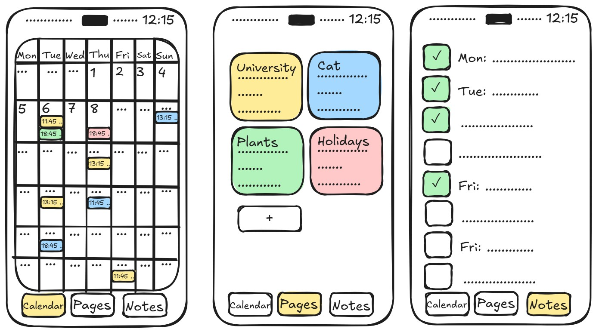
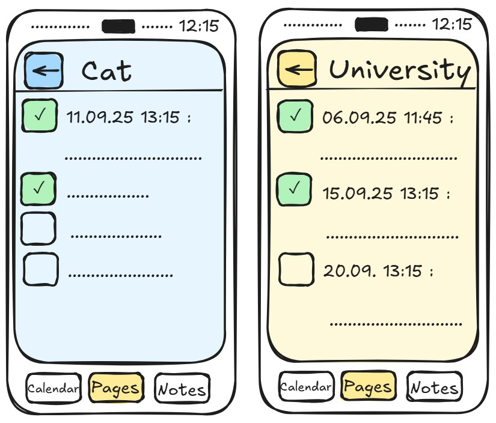

# Step 1: Team Setup and GitHub

- **Project title & short description:**

**HONK!**

A to-do list and scheduling app with a goose-themed design. The app focuses on organization through folder sorting, reminders with pop-up notifications and an integrated calendar.

Users can create detailed schedules for various aspects of their life, such as study plans or plant watering routines. The app allows for custom advanced notifications (e.g., 24 hours and 6 hours before an event, 3 days before an exam, or 15 minutes before medication). A "Do Not Disturb" scheduler lets users mute notifications during important events like conferences or exams.

Using geolocation, the app can send context-aware reminders (e.g., a notification to water plants will only trigger when you are at home).

The core visual and audio theme is geese: notifications use goose honking sounds. The application includes a main calendar view for all events and allows for creating separate, themed pages for individual schedules (e.g., a dedicated page for a pet's vet appointments and medication schedule).

Additional features include the ability to add photos to notes, either from the gallery or taken directly within the app.

- **Team members and roles:**

   Project Leader / Manager: Milissa Laane
  
   Researcher: Daria Savtšenko

   Editor: Elisabeth Serikova

   Lead Developer / Builder: Erik Petrov

   Presenter: Jüri Tsõmbaljuk

- **Planned features:**
1. **Data & Persistence:** Support for both cloud storage and a local database (selectable by the user and expandable depending on the plan).
2. **UI & Navigation:** **Multi-Activity Design:** A multi-screen app with a main calendar view, individual folder/schedule pages, a task creation/edit screen and a settings screen.
3. **API Integration (Device Notifications API):** Integration with the Android System Notification API to schedule and trigger time-based reminders (honking notifications).
4. **Location-Based Services:** Using the device's GPS to create features that interact with the user's physical location (e.g., context-aware reminders).
5. **System Integration (Camera & Media Storage):** Feature to add photos to notes either by taking a picture using the device's camera or by selecting an image from the gallery.
6. **Tools & frameworks: Kotlin, Android Studio, Room DB, Retrofit, Jetpack Compose/XML**

 - **Mockup:**
   
   
 - **License file**
