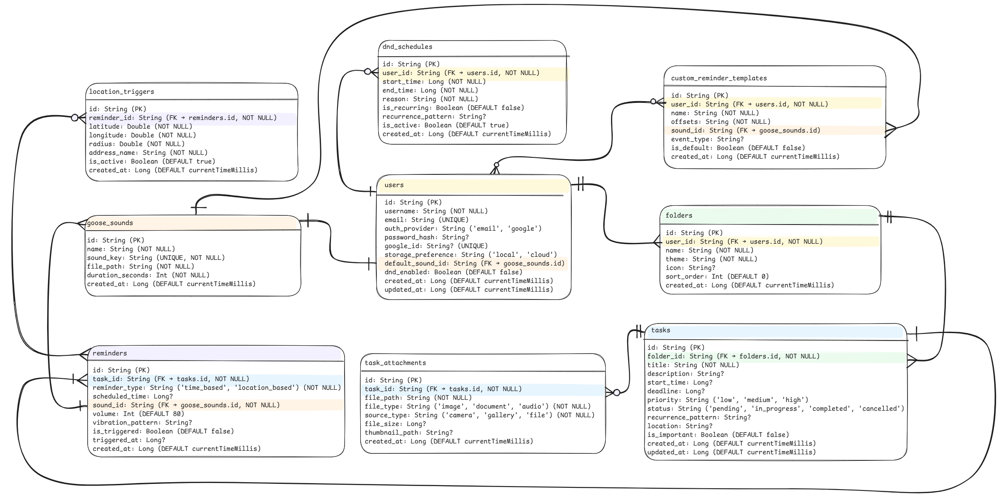
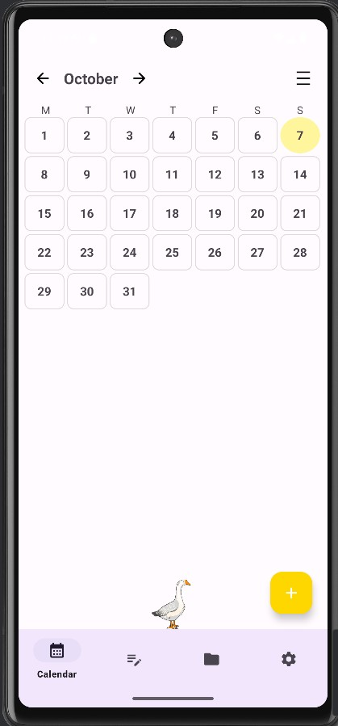
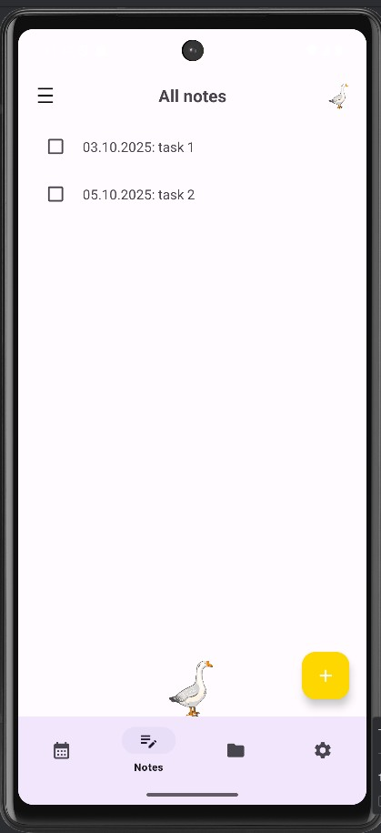
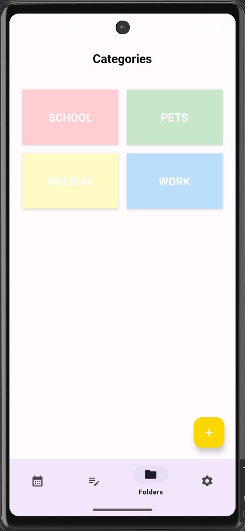

## Step 2 Report: Data Storage/UI & Navigation 

#### **1. Introduction**
The goal of this step was to implement the core structure of a task and note management application. The primary focus was on creating the user interface with key screens, establishing navigation between them and setting up a local Room database for storing and managing data.

#### **2. Implemented Functionality**

##### **User Interface (UI)**
Three main screens were developed, accessible via a bottom navigation bar:
*   **Notes Screen:** Displays a list of all notes/tasks created by the user.
*   **Folders Screen:** Shows a list of categories/folders (e.g., SCHOOL, PETS, HOLIDAY, WORK) for organizing notes.
*   **Calendar Screen:** Provides a calendar view, allowing notes to be associated with specific dates.

##### **Navigation**
Navigation between the main app sections is implemented using a Bottom Navigation Bar. This provides a fast and intuitive way for users to switch between the Notes, Folders and Calendar screens. Each screen is a separate destination in the navigation graph.

##### **Data Model**
A relational data model was implemented using Room Database with proper indexing and foreign keys.

##### **Local Storage**
**Room Persistence Library** is used for local storage. The following components were created:
*   **Entities:** `TaskEntity`, `FolderEntity`, `UserEntity`, `CustomReminderTemplateEntity`, `DndScheduleEntity`, `GooseSoundEntity`, `LocationTriggerEntity`, `ReminderEntity`, `TaskAttachmentEntity`.
*   **DAO (Data Access Objects):** Interfaces like `TaskDao`, `FolderDao`, `UserDao`, `CustomReminderTemplateDao`, `DndScheduleDao`, `GooseSoundDao`, `LocationTriggerDao`, `ReminderDao`, `TaskAttachmentDao` containing methods for core database operations.
*   **Database:** The database classes `HonkDatabase` and `HonkTypeConverters`, which ties all entities and DAOs together.

##### **Form Validation**
Basic validation was implemented on the screen for creating a new note. For example:
*   The "Title" field is mandatory. The user cannot save a note with an empty title.
*   If a user attempts to save without a title, an error message is displayed.

#### **3. Challenges and Solutions**

*   **Challenge 1: Organizing the Complex Database Structure.**
    *   *Description:* Initially, it was challenging to determine which entities were needed and how they should relate to each other (e.g., the Task -> Folder relationship).
    *   **Solution:** We dedicated time to database schema design. We explicitly defined relationships between tables using Foreign Keys in Room and ensured the DAO methods correctly reflected these relationships.

*   **Challenge 2: Finding Simple Mistakes.**
    *   *Description:* Sometimes someone would make a small mistake in the code (for example, a typo in a variable name), and it would take a long time to find it.
    *   **Solution:** We started checking each other's code before committing changes. When one person got stuck, the others would help find the error.

#### **4. Screenshots**

  
  
  

#### **5. Conclusion**
The second step has successfully established a foundation for the HONK! task management application. We've implemented a multi-screen interface with intuitive navigation and a data model supporting complex task management features. The Room database implementation with proper indexing, foreign keys and constraints ensures data integrity and performance. The application is well-structured to support advanced features like recurrence patterns, location-based triggers and priority management in subsequent development stages. The application is ready for further expansion in the next stages, specifically for integration with external APIs.
